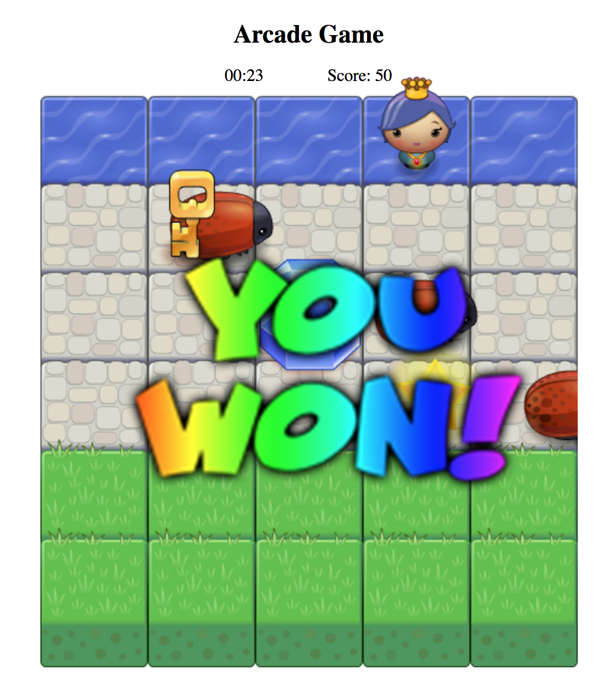
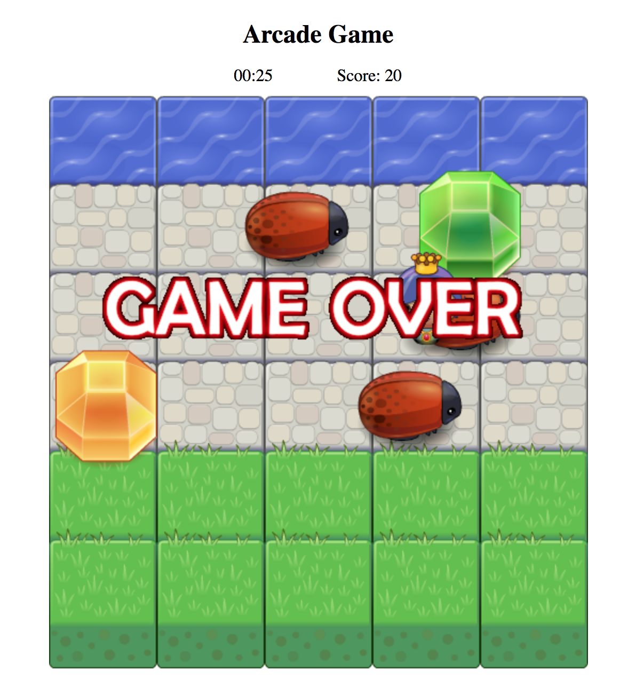

# Classic Arcade Game

## Introduction

This is a classic Arcade Game project which is implemented in HTML5 Canvas and native JavaScript (ES6).

## Run The Game

Open the index.html file in browser to run the game. The latest Google Chrome is recommended.

## Game Rules

In order to succeed, the player need to collect 5 gems (which means 50 points) and then reach the river side (the first row in the Canvas) in 30 seconds. Otherwise, the game fails. Run the game in browser for furthuer instructions.




## Modification

The rules can be changed through updating the properties’ values in the gameStatus object which is inside the app.js file.

```js
var gameStatus = {
    seconds: 30,       // The time that requires players to finish the game.
    score: 0,
    requiredScore: 50,
    gameEnd: false,
    gamePaused: true,  // When the page is loaded, the game is paused by default.
    increaseScore: function(){this.score += 10, scoreLable.innerHTML = this.score},
    checkStatus: function(){return !this.gameEnd && !this.gamePaused},
    isSucceeded: function(){return this.seconds >= 0 && this.score >= this.requiredScore}
};
```

## Attribution

* The start code is provided by [Udacity Frontend Nanodegree team](https://github.com/udacity/frontend-nanodegree-arcade-game).
* The timing function in app.js is modified based on [Stack Overflow](https://stackoverflow.com/questions/5517597/plain-count-up-timer-in-javascript).
* The getting random integer function in app.js is derived from [MDN](https://developer.mozilla.org/en-US/docs/Web/JavaScript/Reference/Global_Objects/Math/random).

## Contribution

All pull requests are welcome.